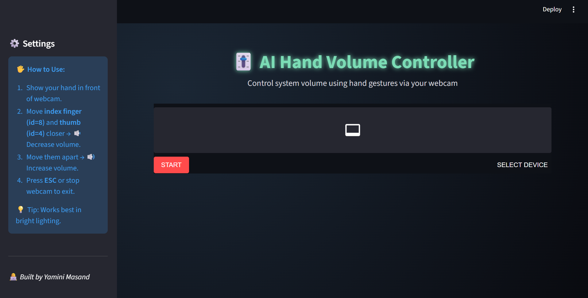

# 🎛️ GestureTune – Hand Gesture Volume Control

Control your computer’s volume using nothing but your **hand gestures** and a **webcam**.  
GestureTune uses **MediaPipe** for real-time hand tracking and **OpenCV** for video processing.  
When you move your thumb and index finger apart, the volume increases; bring them closer, and it decreases.  
Simple, intuitive, and completely touch-free.

---

## ✨ Features
- 🎥 Real-time hand detection using **MediaPipe**
- 🖐️ Detects distance between thumb and index finger
- 🔊 Adjusts system volume dynamically
- 🖥️ Clean **Streamlit** user interface
- ⚡ Fast and lightweight — runs smoothly on most systems

---

## 🧠 Tech Stack
- **Python 3.11+**
- **OpenCV** – for camera and image processing  
- **MediaPipe** – for hand landmark detection  
- **PyAutoGUI** – for controlling system volume  
- **Streamlit** – for interactive UI  

---

## ⚙️ Installation

Clone the repository:
```bash
git clone https://github.com/yaminimasand/GestureTune
cd GestureTune
pip install -r requirements.txt
```
## ▶️ Running the App

To launch the Streamlit interface:
```bash
streamlit run app.py
```
## 🖼️ Demo


